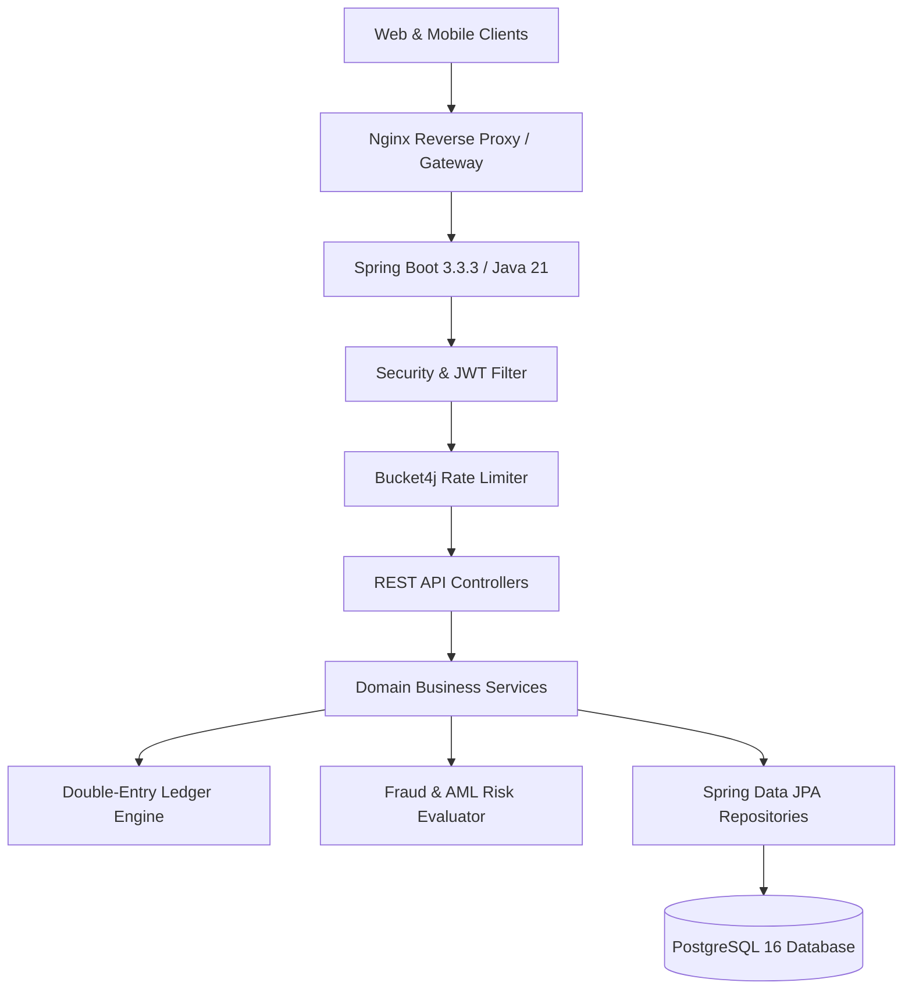

# NeoBank Architecture & System Design Documentation

## 1. High-Level Architecture Overview
NeoBank is built upon a resilient, event-ready micro-modular monolith architecture structured in strict domain-driven layers:
- **Presentation Tier**: Modern React 19 single-page application with TypeScript, Tailwind CSS, Vite, and Lucide icons.
- **Application & API Gateway Tier**: Java 21 / Spring Boot 3 with Spring Security 6, JWT bearer token validation, and rate-limiting via Token Bucket algorithm.
- **Domain & Service Tier**: Transaction orchestration, Double-entry ledger reconciliation, Idempotency tracking, Risk evaluation engine, and KYC compliance pipeline.
- **Persistence Tier**: PostgreSQL 16 relational database with Flyway migration management, optimistic locking with `@Version`, and immutable audit log streams.

## 2. Core Domain Models
- **Identity & Access Management**: Multi-factor authentication, device fingerprint tracking, and session refresh rotation.
- **Ledger & Accounts**: Real-time balance recalculation, multi-currency support, and strict optimistic concurrency control.
- **Transfers & Idempotency**: Distributed UUID idempotency keys preventing double-spending on retried network requests.
- **Cards & Pin Security**: SHA-256 hashed CVV/PIN, real-time lock/freeze, and dynamic velocity spend controls.
- **Loans & Credit**: Continuous compound amortization calculations with amortization schedule generation.
